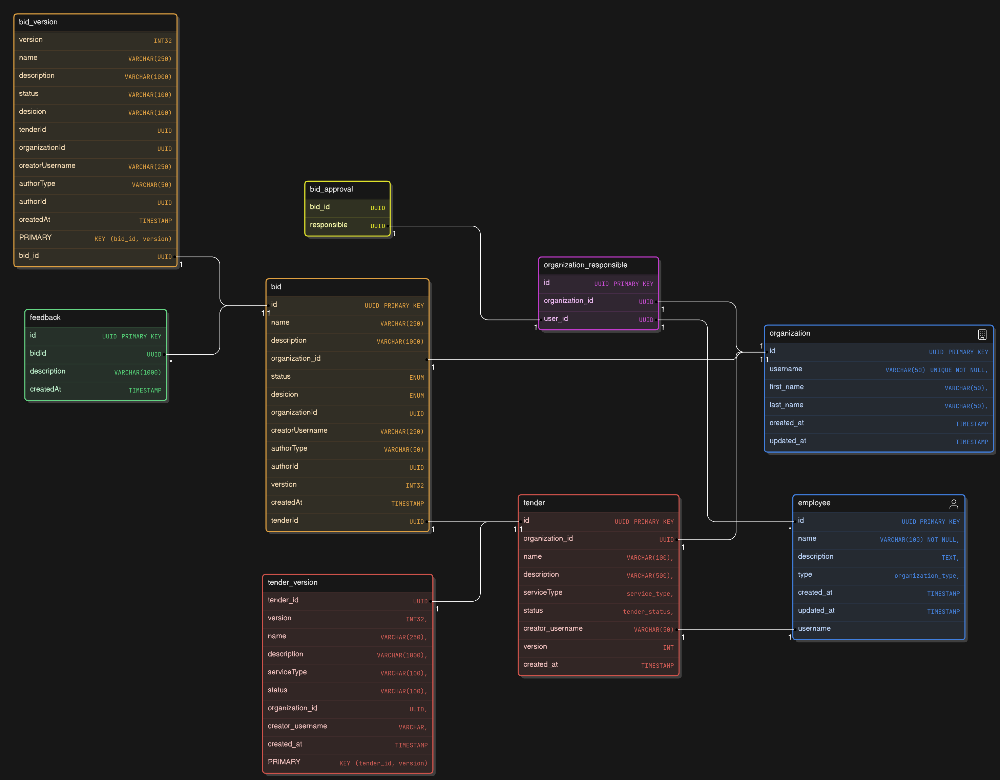

# Дисклеймер
Из-за того, что тесты автоматические и баллы, видимо тоже, начисляются автоматически, боюсь, я могу потерять пару баллов
из-за неточностей в описании бизнес-логики. [Ниже](README.md#логика) подробно

Прочитайте, пожалуйста, и посмотрите исходный код, прежде чем выносить решение по баллам. Я старался:))

PS: тут пришлось экстренно пересобирать проект, поэтому в этот раз без тестовых данных, извините. 
Из-за того что нет организации и ответственных за неё, я не могу протестить в композе. Понадеюсь, что всё работает))
Ибо времени уже нет. Как я сказал, пришлось экстренно пересобирать проект, чтобы  по просьбе организаторов закинуть на гит
## Как запустить

Для первого запуска достаточно:

`make run`

Если хотите перезапустить сервис:

`make restart`

# Введение

Спасибо за тестовое и возможность прокачаться! Мне очень нравится техническая организация с настроенным CI/CD :) 

Я разобрался в кубере на базовом уровне и теперь он не так страшен)
### Стек
- Golang 1.22
- PostgreSQL
#### Либы
- Echo, sqlx, Slog, Validator
- Testify, GoFakeIt

# Логика
В основном я следовал требуемой бизнес-логике, но было много неочевидных моментов, которые стопорили разработку.

Мне пришлось проявить инициативу в решении таких вопросов, потому что, либо где-то не было явно указано поведение 
(например, можно ли изменять **закрытый тендер**), либо было совершенно нелогичное поведение
(например, **статусы предложения ни на что не влияют**)

  
Статусы предложения ни на что не влияют

Проблема: Обратим внимание, что написано [в задании](./задание/README.md#предложение), касательно статусов для предложения.
- Создано: доступен АВТОРУ и ОРГАНИЗАЦИИ
- Опубликовано: доступен АВТОРУ и ОРГАНИЗАЦИИ
- Отменено: доступен АВТОРУ и ОРГАНИЗАЦИИ

Никакой разницы от статуса.

Моё решение: когда предложение имеет статус CREATED, оно доступно только АВТОРУ.
Когда предложение опубликовано (статус PUBLISHED) или отменено (статус CANCELED), его могут видеть все

  
Не понятно, зачем нужен tenderId при просмотре отзывов

В openapi.yml файлике для ручки `/api/bids/{tenderId}/reviews` в URL есть поле tenderId.

Проблема: Сейчас получается так: если у **Данного** пользователя нет предложений к конкретно **Этому** тендеру, то мы не увидим никакие отзывы.
Однако у нашей компании могут быть и **Другие** тендеры,
к которым **Данный** пользователь оставлял предложения, и вот на них могут быть отзывы. Но мы их не получим

Моё решение: если у пользователя нет предложений к конкретно **Этому** тендеру, то сервер скажет, что отзывов не найдено. 
А вот если к **Этому** тендеру есть предложения, то мы увидим вообще _все **отзывы**_ на _все **предложения**_ автора

  
Закрытый тендер

Проблема: в задании не сказано, можно ли его редактировать, менять статус или откатить версию назад

Моё решение: при попытке обратиться к Closed тендеру через ручки
 - `/api/tenders/{tenderId}/status`
 - `/api/tenders/{tenderId}/edit`
 - `/api/tenders/{tenderId}/rollback/{version}`

возвращается статус-код 403 reason: "tender is closed"

  
Предложение отменено или по нему принято решение

Та же история, что и с закрытым тендером.

Проблема: в задании не сказано, можно ли редактировать, менять статус или откатить версию назад для предложения, 
у которого статус Canceled или принято решение.

Моё решение: при попытке обратиться к предложению, у которого статус Canceled или решение = Approved или Rejected, через ручки
 - `/api/bids/{bidId}/status`
 - `/api/bids/{bidId}/edit`
 - `/api/bids/{bidId}/rollback/{version}`

возвращается статус-код 403 reason: "bid is locked"

  
Организации тоже могут оставлять предложения

Если пользователь создает предложение, и указывает authorType как Organization,
то я в базу помещаю не **Его** id, а Id той организации, за которую он ответственен. Если как User, то кладу его Id.
И в поиске по username будут высвечиваться и те предложения, которые он от **Себя** выложил, и те, что от **Организации**.

Для частников все стабильно) В поле authorId я помещаю его id, и поиск буду тоже производить по его никнейму.

- Частник = employee, который не ответственен ни за одну организацию

## Ещё микро моменты
-  В ручке Reviews у меня можно указать название организации, которая создала bid, в поле authorUsername.
А вот в поле requesterUsername нельзя, потому что надо, чтоб ответственные смотрели
- В ручке Reviews автор предложения не может посмотреть отзывы на свои предложения 
(только если он не делал предложения для своей же компании, но хз можно ли так. В моей реализации можно:) ),
потому что
    - 1) Он скорее всего не знает ID тендера
    - 2) В задании написано, что только ответственный за организацию может посмотреть отзывы
- В ручках `api/tenders/my` и `api/bids/my` сделал поле `username` обязательным, потому что в противном случае
ручка теряет смысл (как получить тендеры для пользователя, если мы не знаем пользователя ?)) ).
- В ручках `api/tenders/{tenderId}/rollback/{version}` и `api/bids/{bidId}/rollback/{version}` нельзя откатиться до 
**Текущей** версии.
- Когда тендер закрывается по причине того, что было принято одно предложение, все остальные предложения получают 
решение Rejected и статус Canceled.
- Когда тендер закрывается просто так по решению организации, все предложения получают решение Rejected и статус Canceled.

# Выполнение задания
Создал все необходимые ручки, также выполнил дополнительные задания, в том числе расширенный процесс согласования 
[через кворум](./internal/service/bids.go), а также [конфигурацию линтера](config/.golangci.yml)

Ещё и тестов написал чуть-чуть:)
# Всякие технические заметки
## Диаграмма сущностей базы
Прежде, чем делать базу, я накидал её диаграмму. Для версионирования используются отдельные таблицы. 
Также пришлось сделать таблицу bid_approval для расширенного процесса согласования. 
(Если там есть нужное количество записей для бида, то Approved)
  

Подробнее ознакомиться можете по ссылке
https://app.eraser.io/workspace/nenQrHhqpYsuwezNyBAY?origin=share

### В этот раз без индексов
По хорошему бы ещё в базу прокинуть индексы, чтобы поиск был быстрее, потому что у меня происходит довольно 
много запросов к базе. Нооо... я об этом слишком поздно подумал(вечером последнего дня), не закладывал в изначальную схему. 
А индексы надо с умом делать, так что не стал короче менять под конец ничего.

### Большой интерфейс
К сожалению, у меня не получилось разбить огромный интерфейс Checkers в [storage](./internal/repo/storage.go), потому что
я изначально там расположил 2 больших интерфейса для TenderStorage и для BidStorage и
не закладывал вообще никаких дополнительных методов, а думал обойтись только SQL запросами. (можете это отследить в ранних коммитах, 
например, 1728f6)

Это оказалось слишком сложно, поэтому в моменте начал накидывать методов, а потом интерфейс разросся. 
В последний день я вспомнил, что интерфейсы стоит располагать в месте использования и стараться делать как можно меньше.
Ко всему прочему, там методы для Bids и для Tenders используются в сервисном слое без четкого разделения 
(после получения тендера нужно всем относящимся бидам выставить другой статус и т.д.) 
Этот интерфейс сейчас не проходит линтер `interfacebloat`, так что я его просто отключил))

### Тесты
Написал немного [тестов](tests). Они запускаются локально только с моей базой. 
Моков нет, да и вообще они немного неказистые, потому что писал в последний день и уже было не до того)

### Логгер
Мне нравится мой логгер :)